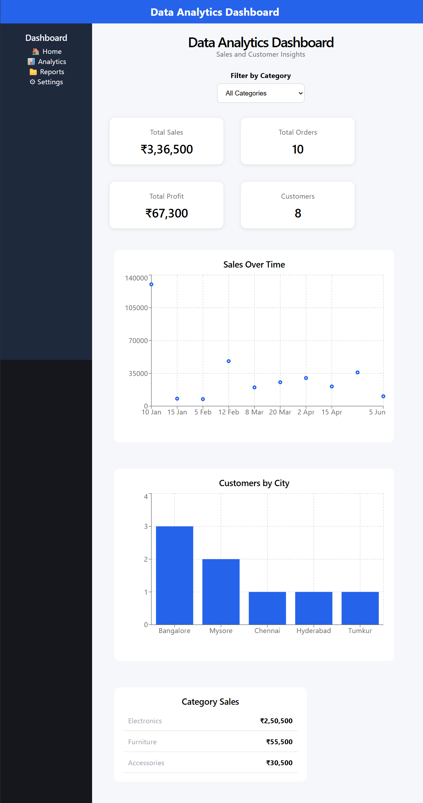

# 📊 Data Analytics Dashboard

A full-stack Data Analytics Dashboard built using React, Node.js, Express.js, and PostgreSQL.

## 📸 Dashboard Preview



## 🚀 Features

- Total Sales
- Total Orders
- Total Profit
- Total Customers
- Sales Over Time
- Customers by City
- Category Sales
- Category filter
- Interactive dashboard cards
- PostgreSQL database integration
- REST API using Express.js

## 🛠️ Technologies Used

### Frontend
- React.js
- Vite
- JavaScript
- CSS

### Backend
- Node.js
- Express.js
- CORS

### Database
- PostgreSQL

## 📁 Project Structure

```text
DataAnalyticsDashboard/
│
├── backend/
│   ├── server.js
│   ├── package.json
│   └── database/
│
├── frontend/
│   ├── src/
│   │   ├── components/
│   │   ├── App.jsx
│   │   └── main.jsx
│   ├── package.json
│   └── vite.config.js
│
└── README.md